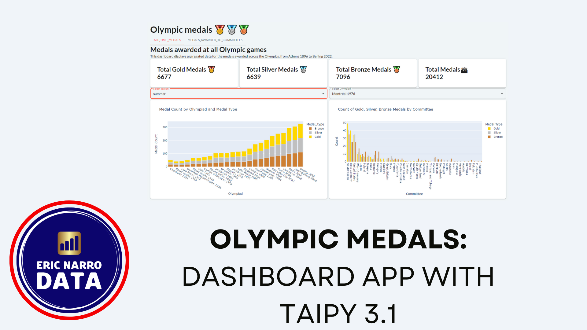

# 🥇🥈🥉 Olympic medals

[](https://github.com/psf/black)


- [🥇🥈🥉 Olympic medals](#-olympic-medals)
  - [Note About Medium Article](#note-about-medium-article)
  - [Changes made in October 2025 (WIP)](#changes-made-in-october-2025-wip)
  - [Changes Made in September 2025](#changes-made-in-september-2025)
  - [Changes Made in June 2025](#changes-made-in-june-2025)
  - [Introduction and Context](#introduction-and-context)
  - [Features](#features)
  - [Running the App](#running-the-app)
    - [Running Directly with uv](#running-directly-with-uv)
    - [Creating a requirements.txt](#creating-a-requirementstxt)
    - [Run with Docker](#run-with-docker)
  - [Data](#data)

## Note About Medium Article

If you came here from [this Medium article I wrote about Taipy 3.1](https://medium.com/gitconnected/discover-taipys-3-1-application-builder-5b8333f2c184), I've changed (improved and refactored) the code ever since. For reference, I keep [this branch](https://github.com/enarroied/Olympic-Medals-Taipy-App/tree/taipy_3.1), but I recommend you take the current version as a reference. **The structure of the dashboard didn't change** (except the table with data by Olympics).

## Changes made in October 2025 (WIP)

- I'm experimenting with an object-oriented and "clean code" approach, where all the charts come from objects that hold the original pandas DataFrame as an attribute. I'm unsure of this being the right approach, but I'm liking how it looks. The code seems to be a bit slower.
- I'm also experimenting with defining functions that "fix" some variables fopr the `Page` objects. The goal here is to reduce the number of arguments when I reuse them constantly, and make the code in the `Page` blocks smaller.
- I'm also using this approach to extend the visual element capabilities, such as with the `create_text_from_file` function.
- To follow clean code principles, I've consistently named functions, and organized them in top-down narrative style (put higher levels of abstraction first, and lower levels of abstraction last)
- I added a favicon to the app
- I simplified imports using `__init__.py` files
- Removed unnecesary comments

## Changes Made in September 2025

- Added `uv` to the project
- Created a Dockerfile for the app
- Added ruff and fixed all linter suggestions, this includes using Pathlib to open files
- Changed README to add installation info, fixed Markdown lineted issues, added a TOC

## Changes Made in June 2025

I refactored and updated the dashboard, here is a summary of what I've done (may not be extensive):

- Updated data to include Paris 2024 results (I updated the Kaggle dataset)
- Updated the requirements, tested it: No errors, no warnings :)
- I changed the input files: from CSV to parquet files. Three main reasons:
  - File Size (for the biggest file): this would be neglectable in most cases, but since I upload this dashboard to a free plan website, size matters!
  - I/O speed: pandas reads parquet faster than CSV
  - parquet retains data types
- I **precomputed data**. This is the biggest performance gain, by precomputing certain aggregates beforehand, the dashboard doesn't need to compute them for every filter change
- Change data types in the pandas DataFrames: I added `pd.categorical` data types to make the DataFrames more efficient
- Created parameter files for the long selector lists (also, these files are automatically created from a notebook that creates the parquet files)
- Separated the code in smaller files, broke the functions into smaller units to have cleaner code
- Moved all initial values to `main.py`, removed duplicates, created an `on_init` function
- Made the table smaller (100 --> 20 rows), put it in an `expandable` block to avoid loading it from start.

## Introduction and Context

Welcome to **Olympic Medals**, a simple Taipy dashboard that shows information about Olympic medals awarded from the beginning of modern Olympic games. The dashboard has two tabs:

- A tab shows aggregated data for all Olympic medals
- A second tab focuses on medals won by Olympic committees (countries, but also special committees, such as the Refugee committee and so on)

The following video presents the dashboard:

[](https://www.youtube.com/watch?v=_1X7etBFTk0)

**Context**: This is a demonstration application. I coded it to illustrate how to use **Taipy 3.1**. Coding this application allowed me to compare it with previous versions of Taipy, I coded a [similar dashboard about wine production in France](https://github.com/enarroied/taipy_wine_app) using Taipy 3.0.

**This dashboard has evolved to use later versions of Taipy**.

I chose to create a dashboard about the Olympic Games because 2024 is an Olympic year in Paris, and I live in France.

The main change of Taipy 3.1 is the way you apply the GUI elements. They replaced their unique Markdown syntax with a more pythonic system that relies on functions. This is what I wanted to test. This project does **not** use Taipy Core.

## Features

- Multi-Page Dashboard: Switch between tabs; the application has two pages.
- Different types of charts: Bar charts, sunburst charts, line charts, choropleth maps and grid charts.
- Dynamic Data Updates: The dashboard dynamically updates data based on the selected year and area type.
- The app has different types of selectors.

## Running the App

The application uses `uv`, but an older version just had a `requirements.txt` file. If you came to this repo from an article showing how to host this app on PythonAnywhere, or if you're just more conformatable with a `requirements.txt` file, I re-created it. It's not a best practice to have them both, but i'll leave it there in case.

### Running Directly with uv

To run the app directly using `uv`, you can run the following command from the root directory:

```bash
uv run --directory src main.py
```

### Creating a requirements.txt

`pip install -r requirements.txt`

The app uses Taipy, Pandas and Plotly.

### Run with Docker

Build the Docker image:

```bash
docker build -t olympics .
```

Run the container (mapping port 5000):

```bash
docker run -p 5000:5000 olympics
```

You can then access the app at: `http://localhost:5000`

## Data

This application uses data from 2 CSV files. You can find them in the `data` repository.

Both datasets are available on Kaggle with complete references:

- [Olympic medals](https://www.kaggle.com/datasets/ericnarro/all-olympic-medals-until-2024-before-paris-games) has all the medals (gold, silver, bronze) awarded at all Olympics.
- [Olympic cities](https://www.kaggle.com/datasets/ericnarro/olympic-cities-summary) has the geographical information about the Olympic cities (the app has maps). It also has some summary information about each Olympic game.
